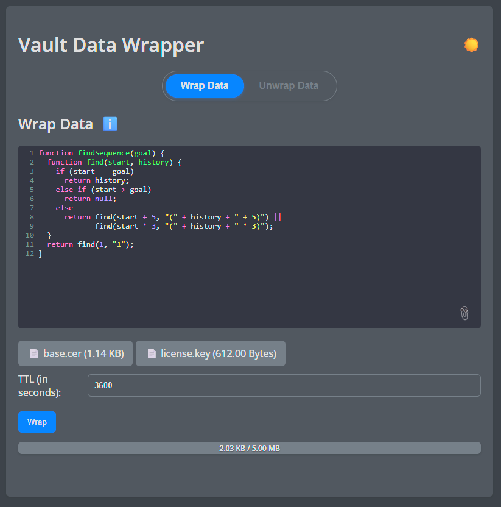
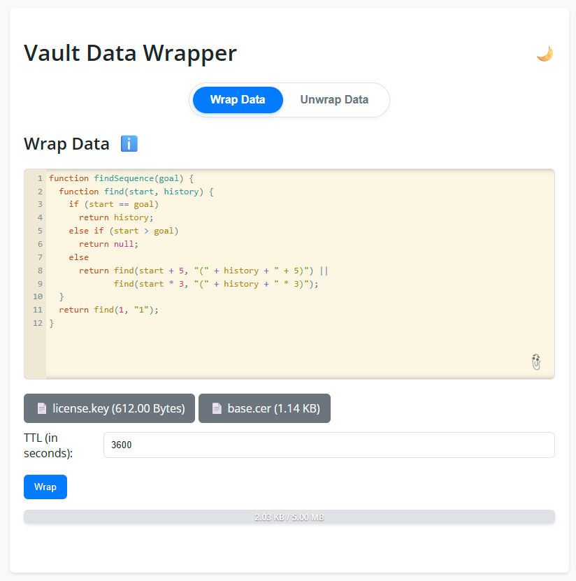

# Vault Data Wrapper

Vault Data Wrapper is a web application that leverages HashiCorp Vault's wrapping feature to securely store and share temporary data, including text snippets, code, and files. It generates time-limited tokens for secure data exchange.

## Features

*   **🔒 Secure Data Wrapping/Unwrapping:** Wraps data with a specified Time-To-Live (TTL), generating a unique token.
*   **🔗 Shareable URLs:** Creates shareable URLs containing the wrapped token for easy access.
*   **✨ User-Friendly Interface:** Provides a modern, responsive UI with syntax highlighting (CodeMirror).
*   **🎨 Persistent Theme:** Remembers user's preferred theme (light/dark) across sessions.
*   **📋 Clipboard Integration:** Simplifies copying tokens and URLs.
*   **📁 File Upload Support:** Allows wrapping of files up to 5MB.

## Getting Started

### Prerequisites

*   [Docker](https://www.docker.com/) and [Docker Compose](https://docs.docker.com/compose/)

### Installation

1.  **Clone the Repository:**

    ```bash
    git clone <repository_url>
    cd vault-data-wrapper
    ```

2.  **Run with Docker Compose:**

    ```bash
    docker-compose up -d --build
    ```

3.  **Access the Application:**

    Open your web browser and navigate to:

    ```
    http://localhost:3001
    ```

    (Adjust `docker-compose.yml` for custom configurations.)

### Configuration

*   **Vault Address:** `http://vault:8200` (configurable via `VAULT_ADDR` environment variable)
*   **Vault Token:** `root` (configurable via `VAULT_TOKEN` environment variable - **Use a secure token in production!**)

### Usage

1.  **Wrap Data:** Enter text/code or upload files, set TTL, and click "Wrap". Copy the generated token or shareable link.
2.  **Unwrap Data:** Open the shareable link or paste the token into the "Unwrap" field and click "Unwrap".

## CLI Usage

You can interact with the API directly using command-line tools.

### curl (Linux, macOS, Windows Git Bash)

**Wrap Data:**
```bash
curl -X POST http://localhost:3001/wrap \
  -H "Content-Type: application/json" \
  -d '{"data": {"text": "My Secret"}, "ttl": "3600"}'
```

**Unwrap Data:**
```bash
curl -X POST http://localhost:3001/unwrap \
  -H "Content-Type: application/json" \
  -d '{"token": "YOUR_TOKEN"}'
```

### PowerShell (Windows)

**Wrap Data:**
```powershell
Invoke-RestMethod -Uri "http://localhost:3001/wrap" -Method Post -ContentType "application/json" -Body (@{data=@{text="My Secret"}; ttl="3600"} | ConvertTo-Json) | ConvertTo-Json
```

**Unwrap Data:**
```powershell
Invoke-RestMethod -Uri "http://localhost:3001/unwrap" -Method Post -ContentType "application/json" -Body (@{token="YOUR_TOKEN"} | ConvertTo-Json) | ConvertTo-Json
```

## Screenshots

 

 

## Built With

*   [Go](https://golang.org/)
*   [HashiCorp Vault](https://www.vaultproject.io/)
*   [Docker](https://www.docker.com/)
*   [CodeMirror](https://codemirror.net/)
